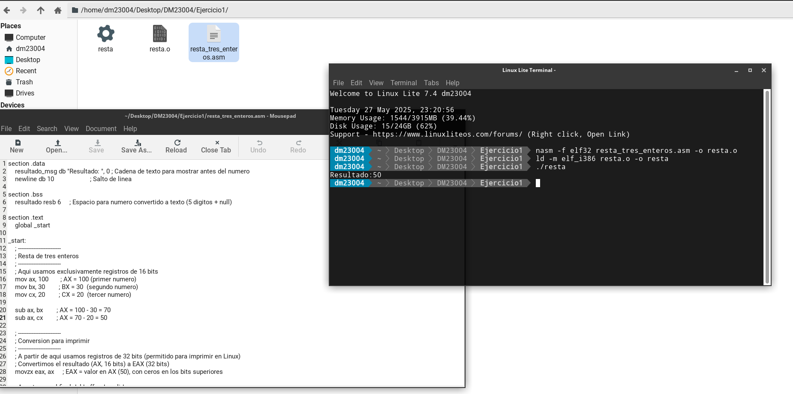
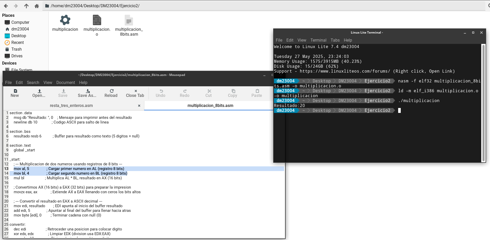
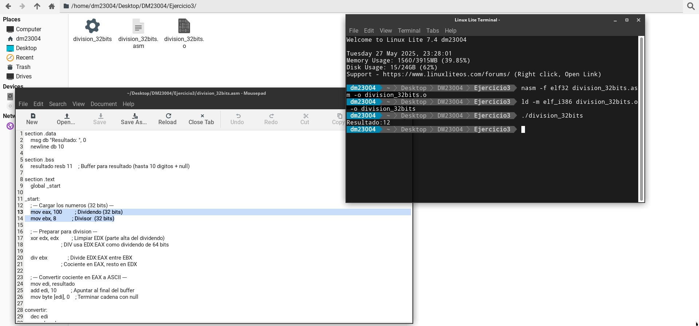

# Portafolio DM23004 - DEC

## 📁 Contenido

---

## Ejercicio 1: Resta de tres enteros (registros de 16 bits)

**Descripción:**  
Se realiza la resta de tres números enteros almacenados en registros de 16 bits (`AX`, `BX` y `CX`). El resultado se imprime por pantalla.

**Código fuente:**  
`resta_tres_enteros.asm`

**Compilación y ejecución:**
```bash
nasm -f elf32 resta_tres_enteros.asm -o resta.o
ld -m elf_i386 resta.o -o resta
./resta
```

**Salida esperada:**



---

### Explicacion sobre uso de registros

Se usaron registros de 16 bits porque la consigna pedia manejar numeros enteros que caben en ese tamano, y para practicar operaciones con registros AX, BX y CX. Sin embargo, para imprimir el resultado, se amplio a 32 bits (EAX) para facilitar la conversion a ASCII y la interaccion con las llamadas al sistema en Linux que requieren argumentos de 32 bits.

---

## Ejercicio 2: Multiplicación de dos enteros (registros de 8 bits)

**Descripción:**  
Se realiza la multiplicación de dos números enteros almacenados en registros de 8 bits (`AL` y `BL`). El resultado se guarda en `AX` (registro de 16 bits) y luego se convierte a ASCII para imprimirlo por pantalla.

**Código fuente:**  
`multiplicacion_8bits.asm`

**Compilación y ejecución:**
```bash
nasm -f elf32 multiplicacion_8bits.asm -o multiplicacion.o
ld -m elf_i386 multiplicacion.o -o multiplicacion
./multiplicacion
```

**Salida esperada:**



---

### Explicacion sobre uso de registros

Se usaron registros de 8 bits para almacenar y multiplicar los dos numeros, porque la consigna especificaba usar registros de 8 bits.  
El resultado se guarda en un registro de 16 bits (AX) porque el producto de dos valores de 8 bits puede ocupar hasta 16 bits.  
Para la conversion y la impresion, se expande a 32 bits (EAX) para facilitar la conversion a ASCII y la llamada al sistema en Linux.

---

## Ejercicio 3: División de dos enteros (registros de 32 bits)

**Descripción:**  
Se realiza la división de dos números enteros almacenados en registros de 32 bits (EAX y EBX). El dividendo se coloca en EAX, el divisor en EBX, y se usa EDX para la parte alta del dividendo (se limpia con XOR). El cociente queda en EAX y el residuo en EDX. Luego, el cociente se convierte a ASCII para imprimirlo por pantalla.

**Código fuente:**  
`division_32bits.asm`

**Compilación y ejecución:**  
```bash
nasm -f elf32 division_32bits.asm -o division_32bits.o
ld -m elf_i386 division_32bits.o -o division_32bits
./division_32bits
```

**Salida esperada:**  



---

### Explicacion sobre uso de registros

Se usaron registros de 32 bits para almacenar y dividir los números porque la consigna pedía manejar números enteros de ese tamaño.  
Para la división, se limpia EDX porque la instrucción `div` opera con el dividendo de 64 bits formado por EDX:EAX.  
Para la conversión y la impresión del resultado, se mantiene el valor en 32 bits (EAX), que es compatible con las llamadas al sistema en Linux.

---

## Requisitos

- Sistema operativo Linux con soporte para binarios de 32 bits.
- NASM instalado.
- `ld` para enlazar los archivos objeto.
- Terminal para ejecutar los programas generados.

---

## Notas finales

Estos ejercicios ayudan a practicar la manipulación de registros de distintos tamaños en ensamblador y la impresión de resultados por consola usando interrupciones del sistema Linux (`int 0x80`).
